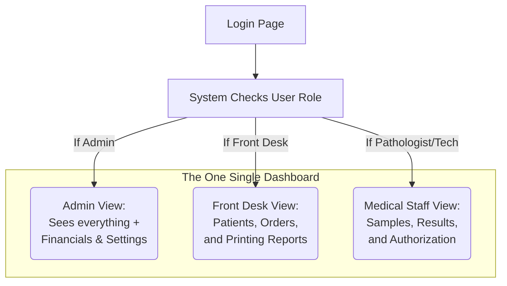

# How LabCore Adapts to Your Staff

LabCore is designed to be incredibly simple for your team to use. Instead of having confusing separate websites for doctors, technicians, and front desk staff, **everyone logs into the exact same dashboard** (`/dashboard`).

However, the software is smart. As soon as a staff member logs in, LabCore instantly transforms to only show the specific tools and buttons they need to do their job, while hiding everything else. 

This is called a **Unified Role-Based Interface**.

---

## 1. How the Dashboard Transforms

When an employee logs in, the system checks their assigned "Role" and instantly builds their personalized dashboard screen.

---

## 2. The Five System Roles

While there are only 3 main visual "Layouts" (Admin, Front Desk, Medical Staff), the system actually has **5 distinct Permission Roles** that build on top of each other. 

Higher roles automatically inherit the abilities of the roles below them (e.g. a Doctor can always step in and do a Technician's job if the lab is short-staffed).

1. **admin** (Superuser)
   * The highest authority. Has access to the hidden "Settings" panel to change Test Prices (Rate Cards), manage staff accounts, edit the Lab Profile, and view all Financial revenue dashboards. Can do everything any other role can do.
2. **pathologist** (Chief Medical Authority)
   * The only role allowed to click the final **"Authorise"** button on patient reports. They review the abnormal results entered by technicians and digitally sign them.
3. **senior_tech** (Reviewer)
   * Can perform all manual lab work, but also has the authority to "Review" a technician's typed results before they go to the Pathologist for final sign-off.
4. **technician** (The Floor)
   * Responsible for the physical manual labor. They view pending samples, click "Draw Blood" (Mark as Collected), and run the machines. They type the raw numbers into the system but cannot authorize them.
5. **front_desk** (Reception)
   * Responsible for customer service. Registers new patients, creates the Orders, accepts cash/payments, and prints the final PDF results to hand to the patient in the waiting room. They cannot edit medical test results.

---

## 3. Why is it built this way?

We built the system this way for three very important reasons:

1. **Safety & Privacy**: A technician simply cannot accidentally view the lab's financial revenue pages, because the button for it gets erased from their screen entirely. If they try to force their way to the page via a direct link, the server acts as a vault door and blocks them.
2. **Less Clutter, Less Training**: Your staff doesn't have to navigate through 30 different buttons they will never use. A front desk worker only sees the 3 to 4 buttons they need to register a patient and accept money. They can learn the system in five minutes!
3. **One Link for Everyone**: You never have to explain to a new hire, "Go to *this* special website link if you are a tech, and *that* link if you are a doctor." Everyone just goes to the standard dashboard, logs in, and the software figures out the rest for them automatically.
