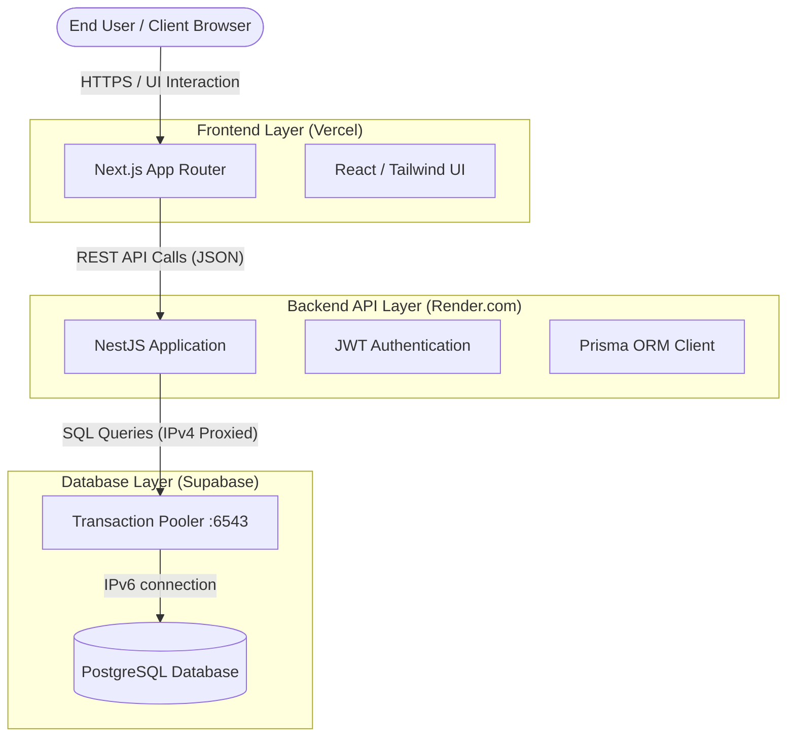
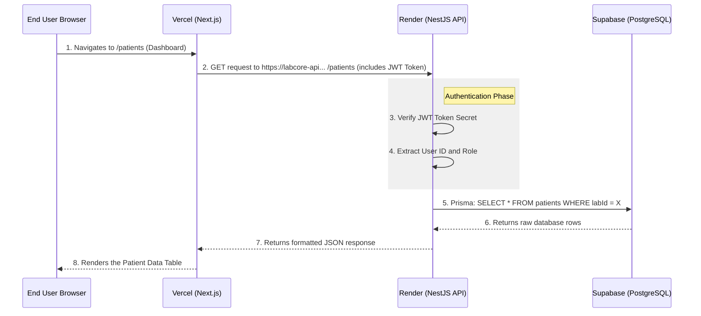
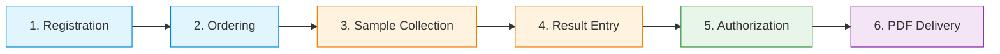

# System Architecture & Workflow

This document outlines the production infrastructure of the LabCore application, how data flows between the different services, and the operational workflow for end-users.

## 1. Production Infrastructure Diagram

LabCore is deployed across three distinct cloud services, separating the frontend, backend, and database for maximum scalability and security.

### Infrastructure Details
*   **Vercel** hosts the Next.js frontend application. It serves the React UI securely over HTTPS.
*   **Render** hosts the NestJS backend API. It listens for requests from the frontend, enforces business logic, and ensures users are authenticated.
*   **Supabase** hosts the highly-available PostgreSQL database. Because Supabase uses IPv6 natively and Render uses IPv4, the backend connects through the **Transaction Pooler**, which effectively bridges the communication gap.

---

## 2. Request Workflow Example

When a user clicks a button on the screen, a precise sequence of events happens connecting the user to the database.

---

## 3. Authentication & Signup Flow

How labs are onboarded and how users log in:

1.  **Lab Registration**: A laboratory owner visits `/auth/register` to input their Lab details and configure an initial Admin account.
2.  **Database Creation**: The API creates a new `Lab` record and an associated `User` record inside the Supabase database. Passwords are securely hashed using `bcryptjs` before escaping the backend.
3.  **Login Request**: When the user enters their email and password at `/login`, the backend verifies the hash and generates a **JSON Web Token (JWT)**.
4.  **Session Management**: The frontend stores this JWT. Every time the frontend asks the backend for data, it attaches this JWT in the `Authorization: Bearer <token>` header, proving the user's identity.

---

## 4. User Roles & Capabilities

LabCore employs a Role-Based Access Control (RBAC) system defined in the database schema.

| Role | Primary Responsibilities |
| :--- | :--- |
| `admin` | Has total system control. Configures lab settings, registers new staff members, creates test definitions, sets pricing (Rate Cards), and views high-level financial dashboards. |
| `front_desk` | The face of the lab. Registers new patients, creates test orders, generates invoices, logs payments, and hands out the final printed PDF reports to patients. |
| `technician` | Works in the laboratory room. Sees incoming orders, draws patient samples (blood, urine), processes them, and types the raw numeric or qualitative results into the system. |
| `senior_tech` | An elevated technician. Performs all technician duties but is also trusted to review completed results to ensure there are no obvious data entry errors before they go to the doctor. |
| `pathologist` | The medical authority. Reviews the final test results against normal reference ranges. Clicks the "Authorise" button. A report **cannot** be printed or finalized until it is authorised by a pathologist. |

---

## 5. The Complete Patient Lifecycle

What actually happens day-to-day when a patient walks into the lab?

1.  **Registration**: (`front_desk`) Registers the patient's demographics (name, age, gender, contact).
2.  **Ordering**: (`front_desk`) Selects the required tests from the Rate Card, generates a unique Order ID, and provides the patient an Invoice.
3.  **Sample Collection**: (`technician`) Views the pending order in the lab, draws the required samples (e.g., EDTA Blood), and physically marks the system status as "Collected".
4.  **Result Entry**: (`technician`) Using lab machines or manual methods, determines the parameter values (e.g., Hemoglobin = 14.2 g/dL) and types them into the result entry screen.
5.  **Authorization**: (`pathologist`) Reviews the entered data. If values look correct, they digitally sign/authorise the results.
6.  **Delivery**: (`front_desk`) Clicks "Generate Report" to create a branded PDF containing the authorised results, which is then printed or emailed to the patient.
