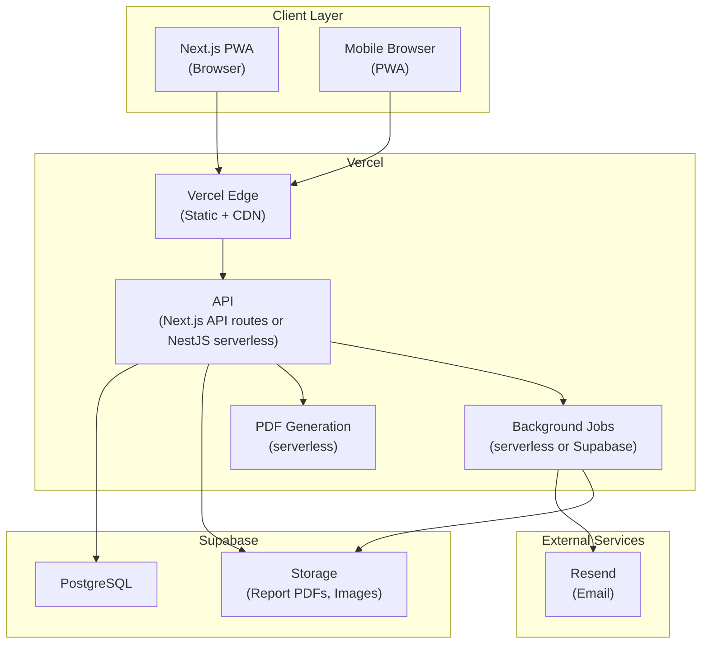
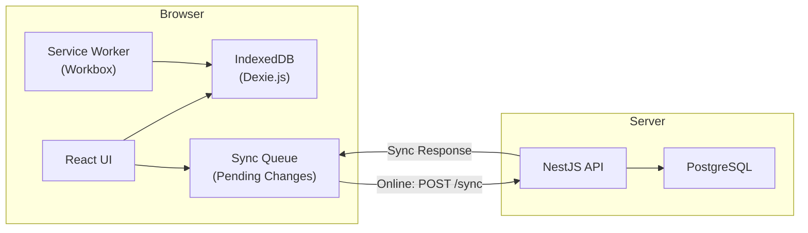
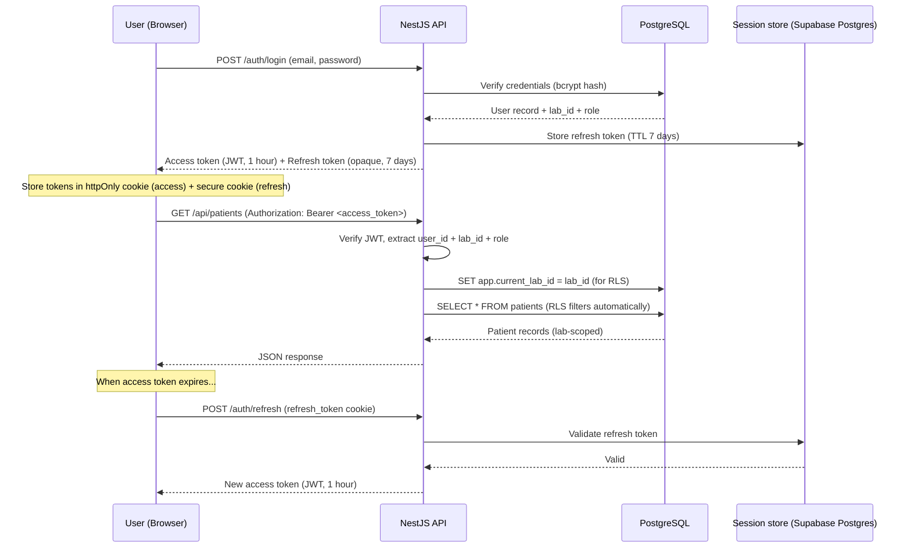
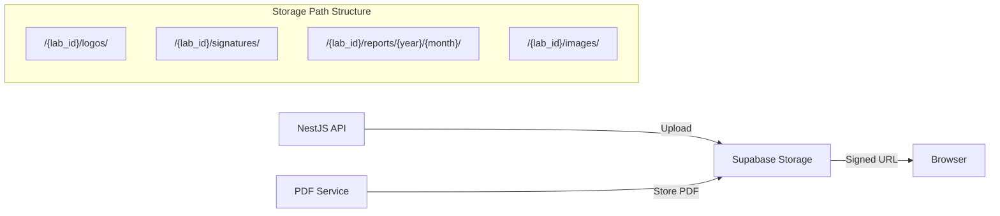
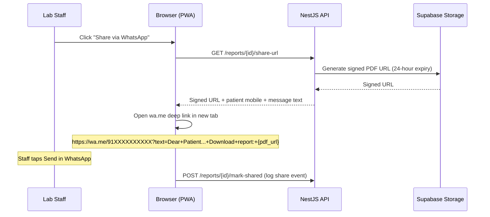
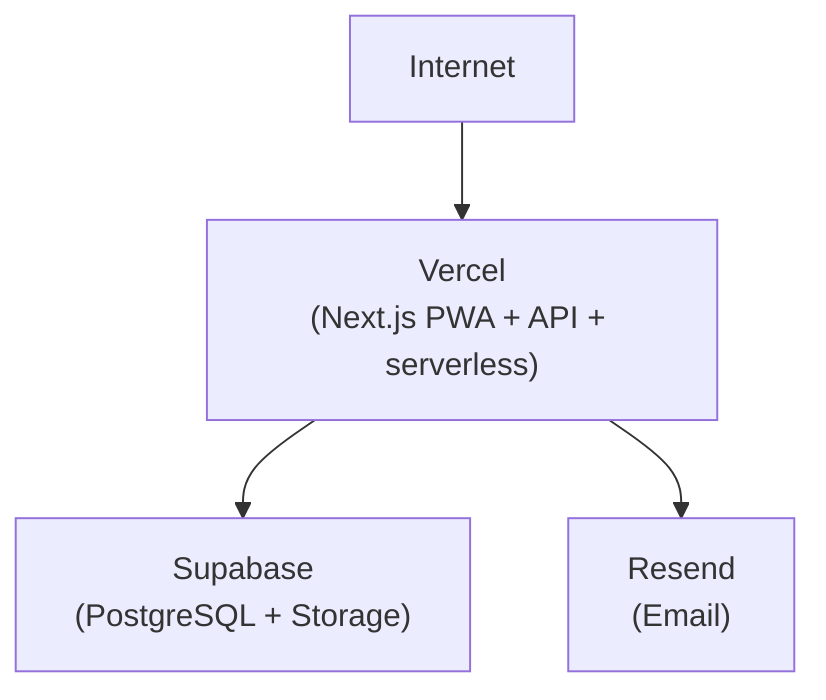

# System Architecture Document

**LabCore LIMS** | Technical Document | February 2025

---

## 1. High-Level Architecture

LabCore follows a client-server architecture with an offline-capable Progressive Web App (PWA) frontend communicating with a REST API backend.



### Component Responsibilities

| Component | Responsibility |
|-----------|---------------|
| Next.js PWA | UI rendering, offline caching (Workbox), local data storage (IndexedDB via Dexie.js), background sync |
| Vercel Edge | Serves static assets (JS, CSS, images) with edge caching; hosts API and serverless functions |
| API | Business logic, authentication, authorisation, CRUD operations, validation, multi-tenancy enforcement |
| PDF Service | Serverless or server-side rendering of HTML report templates to PDF |
| Background Jobs | Async job processing: email dispatch (Resend), PDF generation, sync conflict resolution; via serverless or Supabase |
| PostgreSQL (Supabase) | Primary data store for all structured data; multi-tenant with Row Level Security; sessions in Postgres table |
| Supabase Storage | File storage for generated PDFs, lab logos, pathologist signatures, microscopy images; access via signed URLs |
| Resend | Report delivery via email (free tier) |

---

## 2. Offline-First Sync Architecture

Offline capability is a core requirement. The architecture follows an "offline-first" pattern where the client operates independently and syncs with the server when connectivity is available.



### 2.1 How Offline Works

**Read path (data retrieval)**:
1. On first load (online), the client fetches essential data from the API and caches it in IndexedDB: test master, rate cards, patient list (recent 500), lab profile, user profile
2. Subsequent reads hit IndexedDB first (instant); background refresh from API when online
3. Service Worker caches static assets (HTML, JS, CSS, images) for full offline page loads

**Write path (creating/updating data)**:
1. User creates a patient registration, enters results, or generates a report
2. The write is saved to IndexedDB immediately (UI responds instantly)
3. A sync entry is added to the Sync Queue (IndexedDB table) with: operation type, entity, payload, timestamp, user ID
4. If online: the Sync Queue processor sends the change to the API immediately
5. If offline: the entry stays in the queue; the Service Worker's background sync retries when connectivity returns

**Sync protocol**:
1. Client sends queued changes to `POST /api/sync` as a batch
2. Server processes each change, validates, and persists to PostgreSQL
3. Server responds with: accepted changes (with server-assigned IDs), rejected changes (with reason), and any server-side updates the client needs to merge

### 2.2 Conflict Resolution

Conflicts occur when the same record is modified on two devices while both are offline.

**Strategy**: Last-Write-Wins (LWW) with conflict logging.

1. Each record has an `updated_at` timestamp
2. When the server receives two conflicting updates for the same record, the one with the later `updated_at` wins
3. The losing update is logged in a `sync_conflicts` table with both versions
4. The lab admin is notified of conflicts via an in-app notification
5. For critical data (result values, authorisation status), conflicts are flagged for manual review rather than auto-resolved

**Rationale**: LWW is simple to implement and sufficient for LabCore's use case. In practice, conflicts will be rare because each lab has few users and most records are created/edited by a single person. Full CRDT-based resolution is unnecessary complexity.

### 2.3 Data Cached Offline

| Data | Cache Strategy | Max Size |
|------|---------------|----------|
| Test master (definitions, reference ranges) | Full cache, refresh daily | ~2 MB |
| Rate cards | Full cache, refresh on change | ~100 KB |
| Lab profile and settings | Full cache, refresh on change | ~50 KB |
| Recent patients (last 500) | Partial cache, LRU eviction | ~5 MB |
| Pending orders and worklist | Full cache, real-time sync | ~2 MB |
| Results entered offline | Full cache until synced | Variable |
| Report PDFs (last 50) | Cache for quick re-send | ~25 MB |
| Static assets (app shell) | Workbox precache | ~5 MB |

**Total offline storage**: ~40--50 MB per lab -- well within browser IndexedDB limits (typically 50--80% of available disk).

---

## 3. Multi-Tenancy Architecture

LabCore is a multi-tenant SaaS application. Multiple labs share the same infrastructure but their data is strictly isolated.

### 3.1 Model: Shared Database, Shared Schema

**Decision**: Single PostgreSQL database with a `lab_id` column on every tenant-scoped table. Row Level Security (RLS) policies enforce isolation at the database level.

| Model | Considered | Decision |
|-------|-----------|----------|
| Database-per-tenant | Yes | Rejected: operational overhead of managing hundreds of databases is too high for a small team |
| Schema-per-tenant | Yes | Rejected: migration complexity increases linearly with tenant count |
| **Shared schema + RLS** | Yes | **Selected**: simple, scalable, and secure with PostgreSQL RLS |

### 3.2 How RLS Works

```sql
-- Every table has a lab_id column
-- RLS policy ensures users only see their own lab's data

ALTER TABLE patients ENABLE ROW LEVEL SECURITY;

CREATE POLICY patients_tenant_policy ON patients
  USING (lab_id = current_setting('app.current_lab_id')::uuid);
```

The NestJS API sets `app.current_lab_id` at the beginning of every request based on the authenticated user's lab. All queries automatically filter by this value -- even if application code has a bug and omits a WHERE clause, RLS prevents cross-tenant data access.

### 3.3 Tenant-Scoped vs Global Tables

| Table Type | Examples | lab_id Column? |
|-----------|---------|---------------|
| Tenant-scoped | patients, orders, samples, results, invoices, audit_logs | Yes |
| Global (shared) | test_definitions_master (default templates), subscription_plans | No |
| Lab-customised global | test_definitions (lab's customised copy of master), rate_cards | Yes |

---

## 4. Authentication and Authorisation

### 4.1 Authentication Flow



### 4.2 Token Strategy

| Token | Type | Lifetime | Storage |
|-------|------|----------|---------|
| Access token | JWT (signed, not encrypted) | 1 hour | httpOnly cookie |
| Refresh token | Opaque random string | 7 days | httpOnly secure cookie + Supabase (Postgres session table) |

JWT payload: `{ user_id, lab_id, role, iat, exp }`

### 4.3 Role-Based Access Control (RBAC)

Enforced at the API layer via NestJS Guards. Every API endpoint declares its required role(s).

| Role | Numeric Level | Description |
|------|--------------|-------------|
| ADMIN | 50 | Lab owner. Full access to everything. |
| PATHOLOGIST | 40 | Result authorisation, report signing, dashboard view. |
| SENIOR_TECH | 30 | Result entry, result review, sample management. |
| TECHNICIAN | 20 | Result entry, sample collection/receiving. |
| FRONT_DESK | 10 | Patient registration, order entry, billing, report delivery. |

Permission checks follow a hierarchical model: higher-level roles inherit all permissions of lower-level roles (e.g., ADMIN can do everything FRONT_DESK can do).

---

## 5. File Storage Architecture



| File Type | Storage Path | Access |
|-----------|--------------|--------|
| Lab logo | `/{lab_id}/logos/logo.png` | Public (via Supabase public bucket or signed URL) |
| Pathologist signature | `/{lab_id}/signatures/{pathologist_id}.png` | Private (signed URL for PDF rendering) |
| Report PDFs | `/{lab_id}/reports/{year}/{month}/{report_id}.pdf` | Private (signed URL, 24-hour expiry) |
| Microscopy images | `/{lab_id}/images/{report_id}/{filename}` | Private (signed URL) |

All files are encrypted at rest (Supabase default). Access is via signed URLs generated by the API; lab logos may use public URLs or short-lived signed URLs as needed.

---

## 6. Integration Architecture

### 6.1 WhatsApp Share Flow

WhatsApp report sharing uses free `wa.me` deep links. No server-side API integration is required -- the sharing happens entirely on the client side.



### 6.2 Integration Points (Current + Future)

| Integration | Protocol | Phase | Status |
|-------------|----------|-------|--------|
| WhatsApp wa.me deep links | Client-side URL scheme | MVP | Zero cost, no API key needed |
| Resend Email | REST API | MVP | Report delivery via email (free tier) |
| Thermal printer | Browser Print API | MVP | Label and receipt printing |
| Lab analysers (ASTM/HL7) | RS-232 / TCP socket | Phase 2 | Middleware service |
| Tally ERP | Tally XML / API | Phase 3 | Billing data sync |
| ABDM (ABHA/FHIR) | REST + FHIR R4 | Phase 3 | Health record submission |
| Razorpay | REST (HTTPS) | Phase 3 | Online payment collection |

---

## 7. Deployment Architecture

### 7.1 Infrastructure Diagram



### 7.2 Environment Strategy

| Environment | Purpose | Infrastructure |
|-------------|---------|---------------|
| Local (dev) | Developer machines | Docker Compose (API + PG + Redis) or Supabase local |
| Staging | Pre-production testing | Vercel preview + Supabase (free tier) |
| Production | Live customer data | Vercel + Supabase free tier; Resend for email |

### 7.3 Deployment Pipeline

```
Developer pushes to feature branch
  └── GitHub Actions: lint + type-check + unit tests
       └── PR merged to main
            └── Vercel: auto-deploy from Git (build + deploy)
                 └── Supabase: migrations applied separately or via CI
```

### 7.4 Estimated Monthly Infrastructure Cost (Initial)

| Resource | Specification | Monthly Cost |
|----------|----------------|--------------|
| Vercel | Hobby/Pro free tier | INR 0 |
| Supabase | Free tier (PostgreSQL + Storage) | INR 0 |
| Resend | Free tier (e.g. 3k emails/month) | INR 0 |
| **Total** | | **INR 0** (free tier) |

At MVP scale, infrastructure cost is zero on free tiers. When usage grows, Vercel Pro and Supabase Pro can be added; unit economics remain favourable for INR 499/month pricing.

---

## 8. Scalability Considerations

| Scale Point | Current Design | Scaling Action |
|-------------|---------------|----------------|
| 1--200 labs | Vercel serverless + single Supabase instance | Sufficient |
| 200--500 labs | Vercel auto-scales; Supabase connection pooling | Monitor and upgrade Supabase plan if needed |
| 500--1,000 labs | Database read replicas (Supabase Pro) | Add read replica for dashboard/analytics |
| 1,000--5,000 labs | Consider sharding or tenant-per-schema | Evaluate based on actual load patterns |
| PDF generation bottleneck | Serverless function concurrency | Scale via Vercel or dedicated PDF worker |
| WhatsApp delivery volume | wa.me is client-side | No server-side queue; scale is per-user |

LabCore is designed to not over-engineer for scale prematurely. The initial architecture handles 200+ labs comfortably. Scaling decisions are made based on actual metrics, not hypothetical projections.
