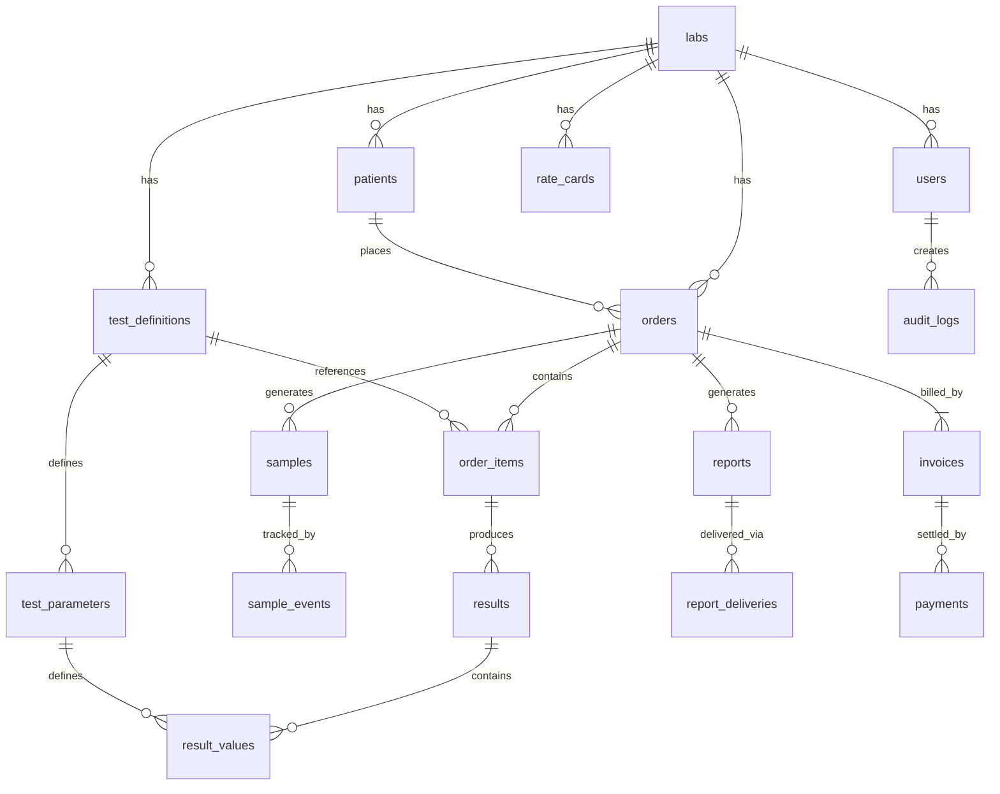

# Database Schema Design

**LabCore LIMS** | Technical Document | February 2025

---

## 1. Overview

LabCore uses PostgreSQL with a shared-schema multi-tenant model. Every tenant-scoped table includes a `lab_id` column with Row Level Security (RLS) enforcing isolation. All tables use UUIDs as primary keys for globally unique identifiers that work with offline sync.

### Conventions

| Convention | Standard |
|-----------|----------|
| Primary key | `id UUID DEFAULT gen_random_uuid()` |
| Timestamps | `created_at TIMESTAMPTZ DEFAULT NOW()`, `updated_at TIMESTAMPTZ DEFAULT NOW()` |
| Soft delete | `deleted_at TIMESTAMPTZ NULL` (null means active) |
| Multi-tenancy | `lab_id UUID NOT NULL REFERENCES labs(id)` on every tenant table |
| Enums | PostgreSQL ENUM types for status fields |
| Naming | snake_case for tables and columns |

---

## 2. Entity Relationship Diagram



---

## 3. Core Entities

### 3.1 labs (Tenant Table)

The root tenant entity. One row per lab customer.

```sql
CREATE TABLE labs (
    id              UUID PRIMARY KEY DEFAULT gen_random_uuid(),
    name            VARCHAR(255) NOT NULL,
    slug            VARCHAR(100) UNIQUE NOT NULL,
    address         TEXT,
    city            VARCHAR(100),
    state           VARCHAR(100) DEFAULT 'Kerala',
    pincode         VARCHAR(10),
    phone           VARCHAR(20),
    email           VARCHAR(255),
    website         VARCHAR(255),
    gstin           VARCHAR(15),
    nabl_cert_no    VARCHAR(50),
    logo_url        VARCHAR(500),
    subscription_plan VARCHAR(50) NOT NULL DEFAULT 'trial',
    subscription_status VARCHAR(20) NOT NULL DEFAULT 'active',
    max_users       INT NOT NULL DEFAULT 2,
    settings        JSONB NOT NULL DEFAULT '{}',
    created_at      TIMESTAMPTZ NOT NULL DEFAULT NOW(),
    updated_at      TIMESTAMPTZ NOT NULL DEFAULT NOW()
);
```

`settings` JSONB stores lab-specific configuration: default language, report template preferences, TAT targets, etc.

### 3.2 users

```sql
CREATE TYPE user_role AS ENUM ('admin', 'pathologist', 'senior_tech', 'technician', 'front_desk');

CREATE TABLE users (
    id              UUID PRIMARY KEY DEFAULT gen_random_uuid(),
    lab_id          UUID NOT NULL REFERENCES labs(id),
    name            VARCHAR(255) NOT NULL,
    email           VARCHAR(255),
    mobile          VARCHAR(20) NOT NULL,
    password_hash   VARCHAR(255) NOT NULL,
    role            user_role NOT NULL DEFAULT 'front_desk',
    signature_url   VARCHAR(500),
    qualification   VARCHAR(255),
    registration_no VARCHAR(100),
    language_pref   VARCHAR(10) NOT NULL DEFAULT 'en',
    is_active       BOOLEAN NOT NULL DEFAULT true,
    last_login_at   TIMESTAMPTZ,
    created_at      TIMESTAMPTZ NOT NULL DEFAULT NOW(),
    updated_at      TIMESTAMPTZ NOT NULL DEFAULT NOW(),
    UNIQUE(lab_id, mobile)
);
```

### 3.3 patients

```sql
CREATE TYPE gender_type AS ENUM ('male', 'female', 'other');

CREATE TABLE patients (
    id              UUID PRIMARY KEY DEFAULT gen_random_uuid(),
    lab_id          UUID NOT NULL REFERENCES labs(id),
    patient_code    VARCHAR(50) NOT NULL,
    name            VARCHAR(255) NOT NULL,
    name_ml         VARCHAR(255),
    age_years       INT,
    age_months      INT,
    age_days        INT,
    date_of_birth   DATE,
    gender          gender_type NOT NULL,
    mobile          VARCHAR(20) NOT NULL,
    email           VARCHAR(255),
    address         TEXT,
    city            VARCHAR(100),
    pincode         VARCHAR(10),
    abha_id         VARCHAR(50),
    notes           TEXT,
    created_at      TIMESTAMPTZ NOT NULL DEFAULT NOW(),
    updated_at      TIMESTAMPTZ NOT NULL DEFAULT NOW(),
    deleted_at      TIMESTAMPTZ,
    UNIQUE(lab_id, patient_code)
);

CREATE INDEX idx_patients_mobile ON patients(lab_id, mobile);
CREATE INDEX idx_patients_name ON patients(lab_id, name);
```

`name_ml` stores the patient name in Malayalam for report localisation.

### 3.4 referring_doctors

```sql
CREATE TABLE referring_doctors (
    id              UUID PRIMARY KEY DEFAULT gen_random_uuid(),
    lab_id          UUID NOT NULL REFERENCES labs(id),
    name            VARCHAR(255) NOT NULL,
    qualification   VARCHAR(255),
    hospital_clinic VARCHAR(255),
    mobile          VARCHAR(20),
    email           VARCHAR(255),
    commission_pct  DECIMAL(5,2) DEFAULT 0,
    is_active       BOOLEAN NOT NULL DEFAULT true,
    created_at      TIMESTAMPTZ NOT NULL DEFAULT NOW(),
    updated_at      TIMESTAMPTZ NOT NULL DEFAULT NOW()
);
```

---

## 4. Test Definition Entities

### 4.1 test_definitions

```sql
CREATE TYPE department_type AS ENUM (
    'haematology', 'biochemistry', 'microbiology', 'serology',
    'histopathology', 'cytology', 'urine', 'clinical_pathology',
    'immunology', 'molecular', 'other'
);

CREATE TYPE sample_type AS ENUM (
    'blood_edta', 'blood_plain', 'blood_citrate', 'blood_fluoride',
    'blood_heparin', 'urine', 'stool', 'sputum', 'csf',
    'body_fluid', 'swab', 'tissue', 'other'
);

CREATE TABLE test_definitions (
    id              UUID PRIMARY KEY DEFAULT gen_random_uuid(),
    lab_id          UUID NOT NULL REFERENCES labs(id),
    test_code       VARCHAR(50) NOT NULL,
    test_name       VARCHAR(255) NOT NULL,
    department      department_type NOT NULL,
    sample_type     sample_type NOT NULL,
    tube_colour     VARCHAR(20),
    is_panel        BOOLEAN NOT NULL DEFAULT false,
    panel_tests     UUID[],
    tat_hours       INT DEFAULT 24,
    price           DECIMAL(10,2) NOT NULL DEFAULT 0,
    is_active       BOOLEAN NOT NULL DEFAULT true,
    sort_order      INT DEFAULT 0,
    report_template VARCHAR(50) DEFAULT 'standard',
    created_at      TIMESTAMPTZ NOT NULL DEFAULT NOW(),
    updated_at      TIMESTAMPTZ NOT NULL DEFAULT NOW(),
    UNIQUE(lab_id, test_code)
);

CREATE INDEX idx_test_definitions_name ON test_definitions(lab_id, test_name);
```

`panel_tests` is a UUID array referencing other test_definitions when `is_panel = true`.

### 4.2 test_parameters

```sql
CREATE TYPE result_type AS ENUM ('numeric', 'qualitative', 'semi_quantitative', 'text', 'formula');

CREATE TABLE test_parameters (
    id                  UUID PRIMARY KEY DEFAULT gen_random_uuid(),
    lab_id              UUID NOT NULL REFERENCES labs(id),
    test_definition_id  UUID NOT NULL REFERENCES test_definitions(id) ON DELETE CASCADE,
    param_name          VARCHAR(255) NOT NULL,
    param_code          VARCHAR(50),
    unit                VARCHAR(50),
    result_type         result_type NOT NULL DEFAULT 'numeric',
    decimal_places      INT DEFAULT 2,
    sort_order          INT NOT NULL DEFAULT 0,

    -- Reference ranges (JSON for age/gender-specific ranges)
    default_ref_range   JSONB,
    -- Example: {"male": {"adult": {"low": 13.0, "high": 17.0}, "child": {"low": 11.0, "high": 14.0}},
    --           "female": {"adult": {"low": 12.0, "high": 15.5}}}

    critical_low        DECIMAL(10,4),
    critical_high       DECIMAL(10,4),

    -- For qualitative tests
    coded_values        TEXT[],

    -- For formula-based calculated fields
    formula             VARCHAR(500),
    formula_params      TEXT[],

    is_active           BOOLEAN NOT NULL DEFAULT true,
    created_at          TIMESTAMPTZ NOT NULL DEFAULT NOW(),
    updated_at          TIMESTAMPTZ NOT NULL DEFAULT NOW()
);
```

`default_ref_range` uses JSONB for flexible age- and gender-specific reference ranges. `formula` stores expressions like `albumin / (total_protein - albumin)` for A/G ratio.

---

## 5. Order and Sample Entities

### 5.1 orders

```sql
CREATE TYPE order_status AS ENUM (
    'registered', 'sample_collected', 'in_process',
    'completed', 'reported', 'cancelled'
);

CREATE TYPE order_priority AS ENUM ('routine', 'urgent', 'stat');

CREATE TABLE orders (
    id                  UUID PRIMARY KEY DEFAULT gen_random_uuid(),
    lab_id              UUID NOT NULL REFERENCES labs(id),
    order_code          VARCHAR(50) NOT NULL,
    patient_id          UUID NOT NULL REFERENCES patients(id),
    referring_doctor_id UUID REFERENCES referring_doctors(id),
    status              order_status NOT NULL DEFAULT 'registered',
    priority            order_priority NOT NULL DEFAULT 'routine',
    clinical_history    TEXT,
    notes               TEXT,
    registered_by       UUID NOT NULL REFERENCES users(id),
    registered_at       TIMESTAMPTZ NOT NULL DEFAULT NOW(),
    completed_at        TIMESTAMPTZ,
    reported_at         TIMESTAMPTZ,
    created_at          TIMESTAMPTZ NOT NULL DEFAULT NOW(),
    updated_at          TIMESTAMPTZ NOT NULL DEFAULT NOW(),
    deleted_at          TIMESTAMPTZ,
    UNIQUE(lab_id, order_code)
);

CREATE INDEX idx_orders_patient ON orders(lab_id, patient_id);
CREATE INDEX idx_orders_status ON orders(lab_id, status);
CREATE INDEX idx_orders_date ON orders(lab_id, registered_at);
```

### 5.2 order_items

```sql
CREATE TABLE order_items (
    id                  UUID PRIMARY KEY DEFAULT gen_random_uuid(),
    lab_id              UUID NOT NULL REFERENCES labs(id),
    order_id            UUID NOT NULL REFERENCES orders(id) ON DELETE CASCADE,
    test_definition_id  UUID NOT NULL REFERENCES test_definitions(id),
    price               DECIMAL(10,2) NOT NULL,
    discount_amount     DECIMAL(10,2) DEFAULT 0,
    discount_pct        DECIMAL(5,2) DEFAULT 0,
    status              VARCHAR(20) NOT NULL DEFAULT 'pending',
    cancelled_at        TIMESTAMPTZ,
    cancel_reason       VARCHAR(255),
    created_at          TIMESTAMPTZ NOT NULL DEFAULT NOW(),
    updated_at          TIMESTAMPTZ NOT NULL DEFAULT NOW()
);
```

### 5.3 samples

```sql
CREATE TYPE sample_status AS ENUM (
    'ordered', 'collected', 'received', 'in_process',
    'completed', 'stored', 'disposed', 'rejected'
);

CREATE TABLE samples (
    id                  UUID PRIMARY KEY DEFAULT gen_random_uuid(),
    lab_id              UUID NOT NULL REFERENCES labs(id),
    sample_code         VARCHAR(50) NOT NULL,
    order_id            UUID NOT NULL REFERENCES orders(id),
    sample_type         sample_type NOT NULL,
    tube_colour         VARCHAR(20),
    status              sample_status NOT NULL DEFAULT 'ordered',
    barcode_data        VARCHAR(100) NOT NULL,
    collected_by        UUID REFERENCES users(id),
    collected_at        TIMESTAMPTZ,
    received_by         UUID REFERENCES users(id),
    received_at         TIMESTAMPTZ,
    rejection_reason    VARCHAR(255),
    rejected_by         UUID REFERENCES users(id),
    rejected_at         TIMESTAMPTZ,
    storage_location    VARCHAR(100),
    disposed_at         TIMESTAMPTZ,
    created_at          TIMESTAMPTZ NOT NULL DEFAULT NOW(),
    updated_at          TIMESTAMPTZ NOT NULL DEFAULT NOW(),
    UNIQUE(lab_id, sample_code)
);

CREATE INDEX idx_samples_barcode ON samples(barcode_data);
CREATE INDEX idx_samples_status ON samples(lab_id, status);
```

### 5.4 sample_events (Chain of Custody)

```sql
CREATE TABLE sample_events (
    id              UUID PRIMARY KEY DEFAULT gen_random_uuid(),
    lab_id          UUID NOT NULL REFERENCES labs(id),
    sample_id       UUID NOT NULL REFERENCES samples(id) ON DELETE CASCADE,
    event_type      VARCHAR(50) NOT NULL,
    event_data      JSONB,
    performed_by    UUID NOT NULL REFERENCES users(id),
    performed_at    TIMESTAMPTZ NOT NULL DEFAULT NOW()
);

CREATE INDEX idx_sample_events_sample ON sample_events(sample_id);
```

Tracks every status change, transfer, and condition flag for NABL audit compliance.

---

## 6. Result Entities

### 6.1 results

```sql
CREATE TYPE result_status AS ENUM (
    'pending', 'entered', 'reviewed', 'authorised', 'amended'
);

CREATE TABLE results (
    id                  UUID PRIMARY KEY DEFAULT gen_random_uuid(),
    lab_id              UUID NOT NULL REFERENCES labs(id),
    order_item_id       UUID NOT NULL REFERENCES order_items(id),
    sample_id           UUID NOT NULL REFERENCES samples(id),
    status              result_status NOT NULL DEFAULT 'pending',
    entered_by          UUID REFERENCES users(id),
    entered_at          TIMESTAMPTZ,
    reviewed_by         UUID REFERENCES users(id),
    reviewed_at         TIMESTAMPTZ,
    authorised_by       UUID REFERENCES users(id),
    authorised_at       TIMESTAMPTZ,
    rejection_comment   TEXT,
    interpretive_notes  TEXT,
    created_at          TIMESTAMPTZ NOT NULL DEFAULT NOW(),
    updated_at          TIMESTAMPTZ NOT NULL DEFAULT NOW()
);

CREATE INDEX idx_results_status ON results(lab_id, status);
CREATE INDEX idx_results_order_item ON results(order_item_id);
```

### 6.2 result_values

```sql
CREATE TABLE result_values (
    id                  UUID PRIMARY KEY DEFAULT gen_random_uuid(),
    lab_id              UUID NOT NULL REFERENCES labs(id),
    result_id           UUID NOT NULL REFERENCES results(id) ON DELETE CASCADE,
    test_parameter_id   UUID NOT NULL REFERENCES test_parameters(id),
    numeric_value       DECIMAL(15,6),
    text_value          TEXT,
    coded_value         VARCHAR(100),
    abnormal_flag       VARCHAR(10),
    ref_range_low       DECIMAL(10,4),
    ref_range_high      DECIMAL(10,4),
    ref_range_text      VARCHAR(255),
    unit                VARCHAR(50),
    created_at          TIMESTAMPTZ NOT NULL DEFAULT NOW(),
    updated_at          TIMESTAMPTZ NOT NULL DEFAULT NOW()
);

CREATE INDEX idx_result_values_result ON result_values(result_id);
```

`abnormal_flag` values: `NULL` (normal), `L` (low), `H` (high), `CL` (critical low), `CH` (critical high).

---

## 7. Report Entities

### 7.1 reports

```sql
CREATE TABLE reports (
    id                  UUID PRIMARY KEY DEFAULT gen_random_uuid(),
    lab_id              UUID NOT NULL REFERENCES labs(id),
    order_id            UUID NOT NULL REFERENCES orders(id),
    report_code         VARCHAR(50) NOT NULL,
    version             INT NOT NULL DEFAULT 1,
    pdf_url             VARCHAR(500),
    pdf_size_bytes      INT,
    qr_verification_code VARCHAR(100),
    is_amended          BOOLEAN NOT NULL DEFAULT false,
    amendment_reason    TEXT,
    generated_by        UUID NOT NULL REFERENCES users(id),
    generated_at        TIMESTAMPTZ NOT NULL DEFAULT NOW(),
    created_at          TIMESTAMPTZ NOT NULL DEFAULT NOW(),
    UNIQUE(lab_id, report_code, version)
);
```

### 7.2 report_deliveries

```sql
CREATE TYPE delivery_channel AS ENUM ('whatsapp', 'email', 'portal', 'print');
CREATE TYPE delivery_status AS ENUM ('queued', 'sent', 'delivered', 'read', 'failed');

CREATE TABLE report_deliveries (
    id              UUID PRIMARY KEY DEFAULT gen_random_uuid(),
    lab_id          UUID NOT NULL REFERENCES labs(id),
    report_id       UUID NOT NULL REFERENCES reports(id),
    channel         delivery_channel NOT NULL,
    recipient_type  VARCHAR(20) NOT NULL,
    recipient_id    UUID,
    recipient_contact VARCHAR(255) NOT NULL,
    status          delivery_status NOT NULL DEFAULT 'queued',
    sent_at         TIMESTAMPTZ,
    delivered_at    TIMESTAMPTZ,
    read_at         TIMESTAMPTZ,
    error_message   TEXT,
    created_at      TIMESTAMPTZ NOT NULL DEFAULT NOW(),
    updated_at      TIMESTAMPTZ NOT NULL DEFAULT NOW()
);
```

---

## 8. Billing Entities

### 8.1 invoices

```sql
CREATE TYPE invoice_status AS ENUM ('draft', 'issued', 'paid', 'partial', 'cancelled');

CREATE TABLE invoices (
    id              UUID PRIMARY KEY DEFAULT gen_random_uuid(),
    lab_id          UUID NOT NULL REFERENCES labs(id),
    invoice_code    VARCHAR(50) NOT NULL,
    order_id        UUID NOT NULL REFERENCES orders(id),
    patient_id      UUID NOT NULL REFERENCES patients(id),
    subtotal        DECIMAL(10,2) NOT NULL,
    discount_total  DECIMAL(10,2) NOT NULL DEFAULT 0,
    tax_amount      DECIMAL(10,2) NOT NULL DEFAULT 0,
    grand_total     DECIMAL(10,2) NOT NULL,
    amount_paid     DECIMAL(10,2) NOT NULL DEFAULT 0,
    amount_due      DECIMAL(10,2) NOT NULL,
    status          invoice_status NOT NULL DEFAULT 'issued',
    gstin           VARCHAR(15),
    hsn_sac_code    VARCHAR(20),
    notes           TEXT,
    issued_by       UUID NOT NULL REFERENCES users(id),
    issued_at       TIMESTAMPTZ NOT NULL DEFAULT NOW(),
    created_at      TIMESTAMPTZ NOT NULL DEFAULT NOW(),
    updated_at      TIMESTAMPTZ NOT NULL DEFAULT NOW(),
    UNIQUE(lab_id, invoice_code)
);

CREATE INDEX idx_invoices_date ON invoices(lab_id, issued_at);
CREATE INDEX idx_invoices_patient ON invoices(lab_id, patient_id);
```

### 8.2 payments

```sql
CREATE TYPE payment_mode AS ENUM ('cash', 'upi', 'card', 'net_banking', 'cheque', 'other');

CREATE TABLE payments (
    id              UUID PRIMARY KEY DEFAULT gen_random_uuid(),
    lab_id          UUID NOT NULL REFERENCES labs(id),
    invoice_id      UUID NOT NULL REFERENCES invoices(id),
    amount          DECIMAL(10,2) NOT NULL,
    mode            payment_mode NOT NULL,
    reference_no    VARCHAR(100),
    notes           VARCHAR(255),
    received_by     UUID NOT NULL REFERENCES users(id),
    received_at     TIMESTAMPTZ NOT NULL DEFAULT NOW(),
    created_at      TIMESTAMPTZ NOT NULL DEFAULT NOW()
);
```

### 8.3 rate_cards

```sql
CREATE TABLE rate_cards (
    id              UUID PRIMARY KEY DEFAULT gen_random_uuid(),
    lab_id          UUID NOT NULL REFERENCES labs(id),
    name            VARCHAR(100) NOT NULL,
    description     VARCHAR(255),
    is_default      BOOLEAN NOT NULL DEFAULT false,
    is_active       BOOLEAN NOT NULL DEFAULT true,
    created_at      TIMESTAMPTZ NOT NULL DEFAULT NOW(),
    updated_at      TIMESTAMPTZ NOT NULL DEFAULT NOW()
);

CREATE TABLE rate_card_items (
    id                  UUID PRIMARY KEY DEFAULT gen_random_uuid(),
    lab_id              UUID NOT NULL REFERENCES labs(id),
    rate_card_id        UUID NOT NULL REFERENCES rate_cards(id) ON DELETE CASCADE,
    test_definition_id  UUID NOT NULL REFERENCES test_definitions(id),
    price               DECIMAL(10,2) NOT NULL,
    created_at          TIMESTAMPTZ NOT NULL DEFAULT NOW(),
    updated_at          TIMESTAMPTZ NOT NULL DEFAULT NOW(),
    UNIQUE(rate_card_id, test_definition_id)
);
```

---

## 9. QC Entities (Phase 2)

### 9.1 qc_results

```sql
CREATE TABLE qc_results (
    id                  UUID PRIMARY KEY DEFAULT gen_random_uuid(),
    lab_id              UUID NOT NULL REFERENCES labs(id),
    test_parameter_id   UUID NOT NULL REFERENCES test_parameters(id),
    control_lot_no      VARCHAR(100) NOT NULL,
    control_level       VARCHAR(20),
    measured_value      DECIMAL(15,6) NOT NULL,
    target_mean         DECIMAL(15,6),
    target_sd           DECIMAL(15,6),
    calculated_sd       DECIMAL(15,6),
    calculated_cv       DECIMAL(8,4),
    westgard_status     VARCHAR(20),
    westgard_rule       VARCHAR(50),
    is_accepted         BOOLEAN NOT NULL DEFAULT true,
    corrective_action   TEXT,
    performed_by        UUID NOT NULL REFERENCES users(id),
    reviewed_by         UUID REFERENCES users(id),
    performed_at        TIMESTAMPTZ NOT NULL DEFAULT NOW(),
    created_at          TIMESTAMPTZ NOT NULL DEFAULT NOW()
);
```

---

## 10. Inventory Entities (Phase 2)

### 10.1 inventory_items

```sql
CREATE TABLE inventory_items (
    id              UUID PRIMARY KEY DEFAULT gen_random_uuid(),
    lab_id          UUID NOT NULL REFERENCES labs(id),
    item_name       VARCHAR(255) NOT NULL,
    item_code       VARCHAR(50),
    category        VARCHAR(100),
    unit            VARCHAR(50),
    current_stock   DECIMAL(10,2) NOT NULL DEFAULT 0,
    reorder_level   DECIMAL(10,2),
    lot_number      VARCHAR(100),
    expiry_date     DATE,
    supplier        VARCHAR(255),
    cost_per_unit   DECIMAL(10,2),
    is_active       BOOLEAN NOT NULL DEFAULT true,
    created_at      TIMESTAMPTZ NOT NULL DEFAULT NOW(),
    updated_at      TIMESTAMPTZ NOT NULL DEFAULT NOW()
);

CREATE TABLE stock_movements (
    id                  UUID PRIMARY KEY DEFAULT gen_random_uuid(),
    lab_id              UUID NOT NULL REFERENCES labs(id),
    inventory_item_id   UUID NOT NULL REFERENCES inventory_items(id),
    movement_type       VARCHAR(20) NOT NULL,
    quantity            DECIMAL(10,2) NOT NULL,
    reference_no        VARCHAR(100),
    notes               TEXT,
    performed_by        UUID NOT NULL REFERENCES users(id),
    performed_at        TIMESTAMPTZ NOT NULL DEFAULT NOW()
);
```

---

## 11. Audit Entities

### 11.1 audit_logs

```sql
CREATE TABLE audit_logs (
    id              UUID PRIMARY KEY DEFAULT gen_random_uuid(),
    lab_id          UUID NOT NULL REFERENCES labs(id),
    user_id         UUID NOT NULL REFERENCES users(id),
    action          VARCHAR(50) NOT NULL,
    entity_type     VARCHAR(50) NOT NULL,
    entity_id       UUID NOT NULL,
    old_values      JSONB,
    new_values      JSONB,
    ip_address      INET,
    user_agent      VARCHAR(500),
    created_at      TIMESTAMPTZ NOT NULL DEFAULT NOW()
);

CREATE INDEX idx_audit_logs_entity ON audit_logs(lab_id, entity_type, entity_id);
CREATE INDEX idx_audit_logs_user ON audit_logs(lab_id, user_id);
CREATE INDEX idx_audit_logs_date ON audit_logs(lab_id, created_at);
```

This table is append-only. No UPDATE or DELETE operations are permitted -- enforced at the application layer and via a database trigger that prevents modifications.

### 11.2 sync_queue (Offline Sync)

```sql
CREATE TABLE sync_queue (
    id              UUID PRIMARY KEY DEFAULT gen_random_uuid(),
    lab_id          UUID NOT NULL REFERENCES labs(id),
    user_id         UUID NOT NULL REFERENCES users(id),
    operation       VARCHAR(20) NOT NULL,
    entity_type     VARCHAR(50) NOT NULL,
    entity_id       UUID NOT NULL,
    payload         JSONB NOT NULL,
    client_timestamp TIMESTAMPTZ NOT NULL,
    server_timestamp TIMESTAMPTZ,
    status          VARCHAR(20) NOT NULL DEFAULT 'pending',
    conflict_data   JSONB,
    created_at      TIMESTAMPTZ NOT NULL DEFAULT NOW()
);
```

### 11.3 sync_conflicts

```sql
CREATE TABLE sync_conflicts (
    id              UUID PRIMARY KEY DEFAULT gen_random_uuid(),
    lab_id          UUID NOT NULL REFERENCES labs(id),
    sync_queue_id   UUID NOT NULL REFERENCES sync_queue(id),
    entity_type     VARCHAR(50) NOT NULL,
    entity_id       UUID NOT NULL,
    client_version  JSONB NOT NULL,
    server_version  JSONB NOT NULL,
    resolution      VARCHAR(20),
    resolved_by     UUID REFERENCES users(id),
    resolved_at     TIMESTAMPTZ,
    created_at      TIMESTAMPTZ NOT NULL DEFAULT NOW()
);
```

---

## 12. Indexes Summary

Key indexes beyond primary keys and unique constraints:

| Table | Index | Purpose |
|-------|-------|---------|
| patients | `(lab_id, mobile)` | Patient lookup by phone |
| patients | `(lab_id, name)` | Patient search by name |
| orders | `(lab_id, status)` | Worklist filtering |
| orders | `(lab_id, registered_at)` | Date-based queries |
| samples | `(barcode_data)` | Barcode scan lookup (cross-tenant safe via RLS) |
| samples | `(lab_id, status)` | Pending sample dashboard |
| results | `(lab_id, status)` | Authorisation queue |
| invoices | `(lab_id, issued_at)` | Financial reporting |
| audit_logs | `(lab_id, entity_type, entity_id)` | Audit trail per entity |
| audit_logs | `(lab_id, created_at)` | Date-range audit queries |
